<!-- README.md is generated from README.Rmd. Please edit that file -->


Diamonds
========

This page is intended to accompany the article *Seeing Diamonds: Statistical Graphics in the Introductory Course* by David Kahle.

Setting up the basic elements
-----------------------------

Load in the required libraries.

``` {.r}
library(ggplot2); theme_set(theme_bw(14))
library(plyr)
library(reshape2)
```

Export the diamonds dataset as a .csv file
------------------------------------------

``` {.r}
# write.csv(diamonds, "diamonds.csv", row.names = FALSE)
file.show("diamonds.csv")

length(unique(diamonds$price))
#> [1] 11602

n <- nrow(diamonds)
p <- ncol(diamonds)
```

One dimensional discrete graphics
---------------------------------

Compute the frequency and relative frequency distributions.

``` {.r}
table(diamonds$cut)
#> 
#>      Fair      Good Very Good   Premium     Ideal 
#>      1610      4906     12082     13791     21551
round(table(diamonds$cut) / n, 3)
#> 
#>      Fair      Good Very Good   Premium     Ideal 
#>     0.030     0.091     0.224     0.256     0.400
sum(round(table(diamonds$cut) / n, 3)) # take the .001 off of ideal
#> [1] 1.001
```

The bar chart:

``` {.r}
qplot(cut, data = diamonds) +
   xlab("Cut") + ylab("Frequency")
```

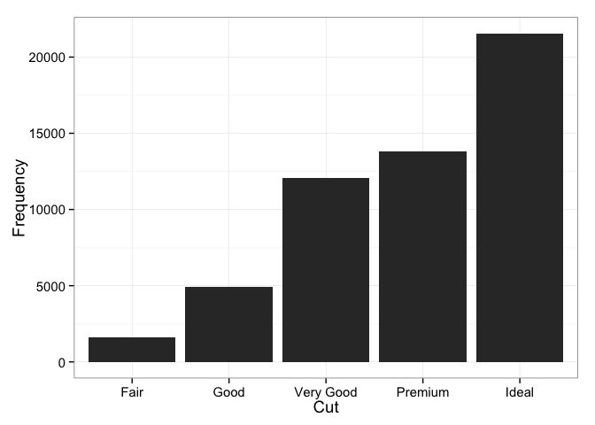

The pie chart:

``` {.r}
ggplot(
    aes(x = 1, y = V1, fill = cut), 
   data = ddply(diamonds, "cut", nrow)
  ) +
  geom_bar(stat = "identity") +
  coord_polar(theta = "y") +
  scale_x_continuous("", breaks = NULL) +
  scale_y_continuous("", breaks = NULL)
```

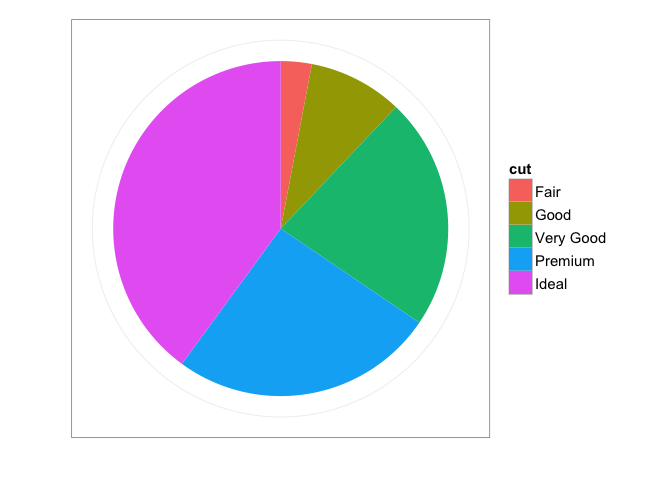

One dimensional continuous graphics
-----------------------------------

Extract the 50 diamonds to make the graphics:

``` {.r}
set.seed(1)
fiftyRows <- sample(n, 50)
fiftyDiamonds <- diamonds[fiftyRows,]
```

### Scatterplots

Make the 1d scatterplot:

``` {.r}
qplot(carat, 0L, data = fiftyDiamonds, size = I(8)) +
  geom_hline(yintercept = 0) +
  scale_x_continuous("Carat", lim = c(0,2.5)) +
  scale_y_continuous("", lim = c(-1,1), breaks = NULL)
```

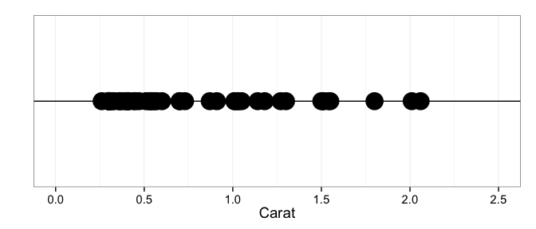

Sample the points to jitter on the *y* axis and then make the jittered scatterplot:

``` {.r}
fiftyDiamonds$yValues <- runif(50, -1, 1)
qplot(carat, yValues, data = fiftyDiamonds, size = I(8)) +
  geom_hline(yintercept = 0) +
  scale_x_continuous("Carat", lim = c(0,2.5)) +
  scale_y_continuous("", lim = c(-1,1), breaks = NULL)
```

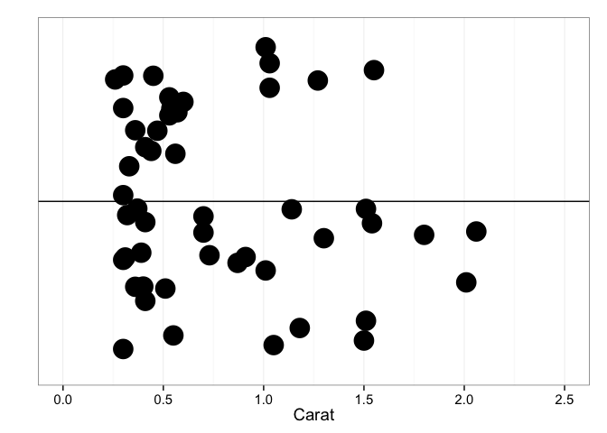

Use alpha blending:

``` {.r}
qplot(carat, yValues, data = fiftyDiamonds, size = I(8), alpha = I(.33)) +
  geom_hline(yintercept = 0) +
  scale_x_continuous("Carat", lim = c(0,2.5)) +
  scale_y_continuous("", lim = c(-1,1), breaks = NULL)
```

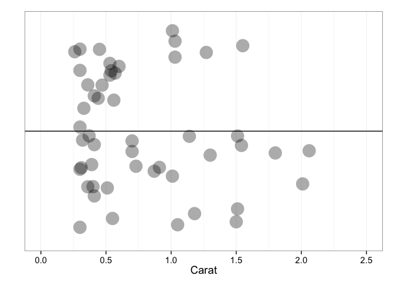

And resize the points:

``` {.r}
qplot(carat, yValues, data = fiftyDiamonds, size = I(5), alpha = I(.33)) +
  geom_hline(yintercept = 0) +
  scale_x_continuous("Carat", lim = c(0,2.5)) +
  scale_y_continuous("", lim = c(-1,1), breaks = NULL)
```


Do all three at once:

``` {.r}
qplot(carat, runif(n, -1, 1), data = diamonds, size = I(5), alpha = I(.01)) +
  geom_hline(yintercept = 0) +
  scale_x_continuous("Carat", lim = c(0,2.5)) +
  scale_y_continuous("", lim = c(-1,1), breaks = NULL)
#> Warning: Removed 126 rows containing missing values (geom_point).
```

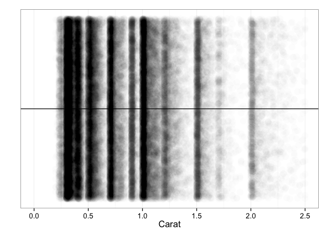

### Histograms

The basic histogram (binwidth = .17):

``` {.r}
qplot(carat, data = diamonds) +
  scale_x_continuous("Carat", lim = c(0,5)) +
  ylab("Frequency")
#> stat_bin: binwidth defaulted to range/30. Use 'binwidth = x' to adjust this.
```

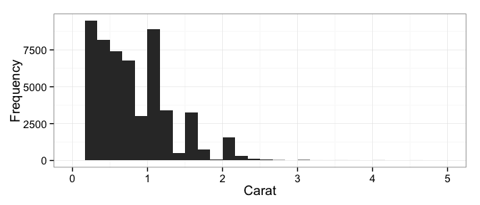

The histograms with binwidth 2 and .01:

``` {.r}
qplot(carat, data = diamonds, binwidth = 2) +
  scale_x_continuous("Carat", lim = c(0,5)) +
  ylab("Frequency")
```

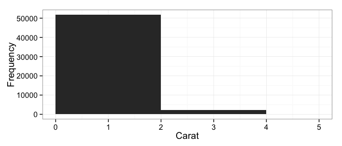

``` {.r}


qplot(carat, data = diamonds, binwidth = .01) +
  scale_x_continuous("Carat", lim = c(0,5)) +
  ylab("Frequency") + geom_vline(xintercept = .9)
#> Warning: position_stack requires constant width: output may be incorrect
```

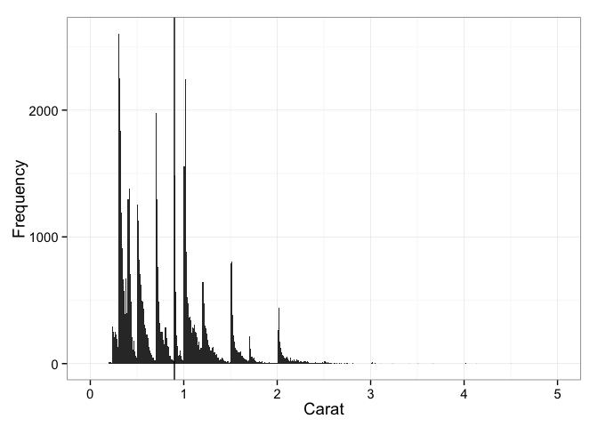

Compute the price differences between just under 1 and just over 1 carat diamonds:

``` {.r}
slightlySmallerDiamonds <- subset(diamonds, .99 <= carat & carat < 1)
nrow(slightlySmallerDiamonds)
#> [1] 23
mean(slightlySmallerDiamonds$price)
#> [1] 4406.174
median(slightlySmallerDiamonds$price)
#> [1] 4780

slightlyBiggerDiamonds <- subset(diamonds, 1 <= carat & carat < 1.01)
nrow(slightlyBiggerDiamonds)
#> [1] 1558
mean(slightlyBiggerDiamonds$price)
#> [1] 5241.59
median(slightlyBiggerDiamonds$price)
#> [1] 4864

qplot(price, data = slightlySmallerDiamonds)
#> stat_bin: binwidth defaulted to range/30. Use 'binwidth = x' to adjust this.
```

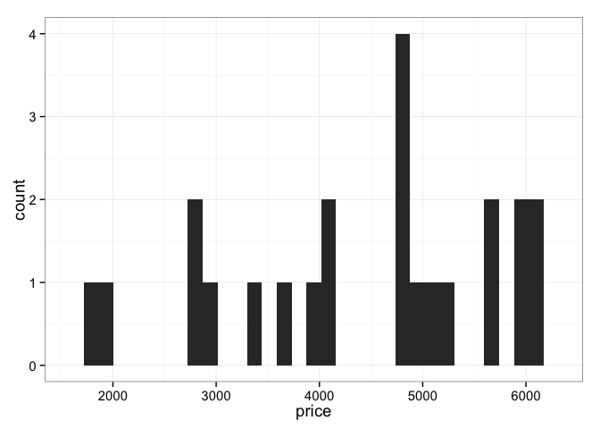

``` {.r}

qplot(price, data = slightlyBiggerDiamonds)
#> stat_bin: binwidth defaulted to range/30. Use 'binwidth = x' to adjust this.
```

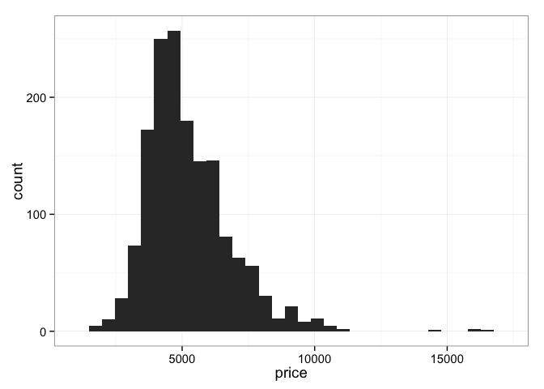

``` {.r}

t.test(
  slightlyBiggerDiamonds$price,
  slightlySmallerDiamonds$price, 
  alternative = "greater"
)
#> 
#>  Welch Two Sample t-test
#> 
#> data:  slightlyBiggerDiamonds$price and slightlySmallerDiamonds$price
#> t = 3.0049, df = 22.971, p-value = 0.003161
#> alternative hypothesis: true difference in means is greater than 0
#> 95 percent confidence interval:
#>  358.9109      Inf
#> sample estimates:
#> mean of x mean of y 
#>  5241.590  4406.174
```

### Kernel density estimators

``` {.r}
# the x-axis sequence on which to eval the kernels
s <- seq(0, 2.5, length.out = 501)

# evaluate the kernels at each
little_densities <- lapply(as.list(fiftyDiamonds$carat), function(mu){
  dnorm(s, mu, sd = .05) / 50
})

# aggregate and sum
df <- as.data.frame(t(plyr:::list_to_dataframe(little_densities)))
names(df) <- paste0("mu=", fiftyDiamonds$carat)
df$x <- s
mdf <- melt(df, id = "x")
kde <- ddply(mdf, "x", function(df) sum(df$value) )

# plot
ggplot() +
  geom_line(
    aes(x = x, y = value, group = variable),
    size = .2,
    data = mdf
  ) +
  geom_line(
    aes(x = x, y = V1),
    size = 1, color = "red",
    data = kde
  ) +
  scale_x_continuous("Carat", lim = c(0,2.5)) +
  ylab("Density") 
```

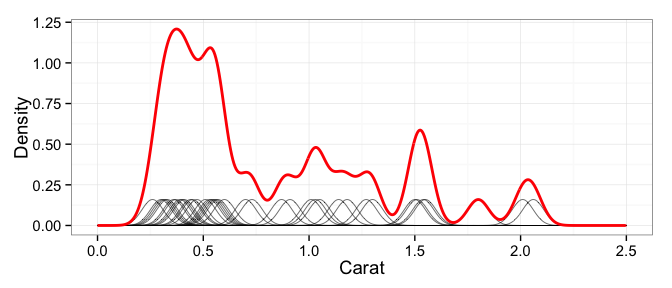

Make the associated histogram:

``` {.r}
qplot(carat, ..density.., data = fiftyDiamonds, geom = "histogram") +
  scale_x_continuous("Carat", lim = c(0,2.5)) +
  ylab("Density")
#> stat_bin: binwidth defaulted to range/30. Use 'binwidth = x' to adjust this.
```


Continuous-continuous graphics
------------------------------

### The two-dimensional scatterplot

The basic 2d scatterplot:

``` {.r}
qplot(carat, price, data = diamonds) +
  scale_x_continuous("Carat") +
  scale_y_continuous("Price")
```

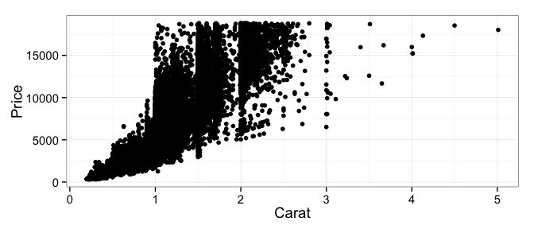

Use alpha blending and resize:

``` {.r}
qplot(carat, price, data = diamonds, alpha = I(.05), size = I(1)) +
  scale_x_continuous("Carat") +
  scale_y_continuous("Price")
```


### The two-dimensional histogram

Make the basic 2d histogram:

``` {.r}
qplot(carat, price, data = diamonds, geom = "bin2d") +
  scale_x_continuous("Carat") +
  scale_y_continuous("Price") +
  scale_fill_continuous("Frequency")
```

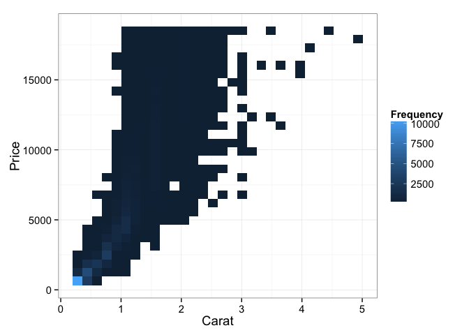

Make an elaborate 2d histogram:

``` {.r}
qplot(carat, price, data = diamonds, geom = "hex", bins = 100) +
  scale_x_continuous("Carat") +
  scale_y_continuous("Price") +
  scale_fill_gradientn("Frequency",
    colours = c("#132B43", "#56B1F7", "yellow", "red"),
    values = c(0.00, 0.025, 0.15, 1.00),
    breaks = c(100,250,500,1000,2000)
  )
```

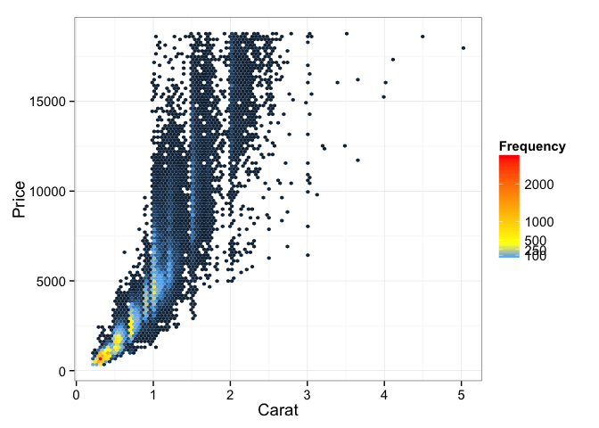

Add a smoother:

``` {.r}
qplot(carat, price, data = diamonds, geom = "hex", bins = 100) +
  stat_smooth(color = "red", size = 2) +
  scale_x_continuous("Carat") +
  scale_y_continuous("Price") +
  scale_fill_gradientn("Frequency",
    colours = c("#132B43", "#56B1F7", "yellow", "red"),
    values = c(0.00, 0.025, 0.15, 1.00),
    breaks = c(100,250,500,1000,2000)
  )
#> geom_smooth: method="auto" and size of largest group is >=1000, so using gam with formula: y ~ s(x, bs = "cs"). Use 'method = x' to change the smoothing method.
```


### The contour plot

(The one in the paper is made with Mathematica.)

``` {.r}
ggplot(aes(x = carat, y = price), data = diamonds) +
  stat_density2d() +
  scale_x_continuous("Carat", lim = c(0,4)) +
  scale_y_continuous("Price", lim = c(0,18000))
#> Warning: Removed 315 rows containing non-finite values (stat_density2d).
```

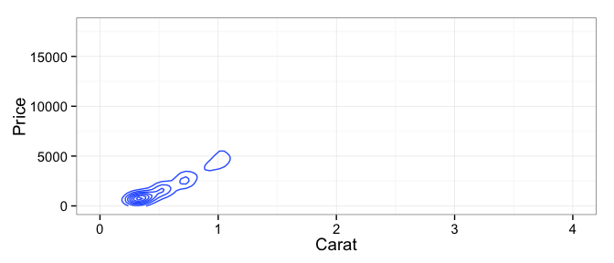

Discrete-continuous graphics
----------------------------

The naive scatterplot:

``` {.r}
qplot(clarity, price, data = diamonds) +
  scale_x_discrete("Clarity") +
  scale_y_continuous("Price")
```

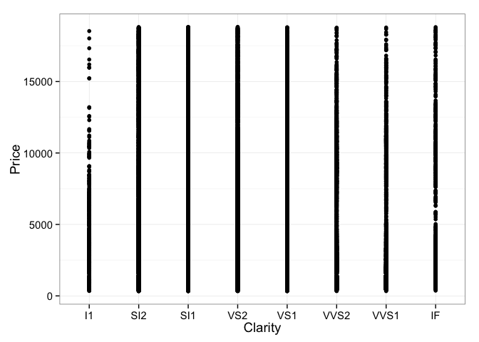

Adding jittering and alpha blending:

``` {.r}
qplot(clarity, price, data = diamonds, geom = "jitter", alpha = I(.05)) +
  scale_x_discrete("Clarity") +
  scale_y_continuous("Price")
```

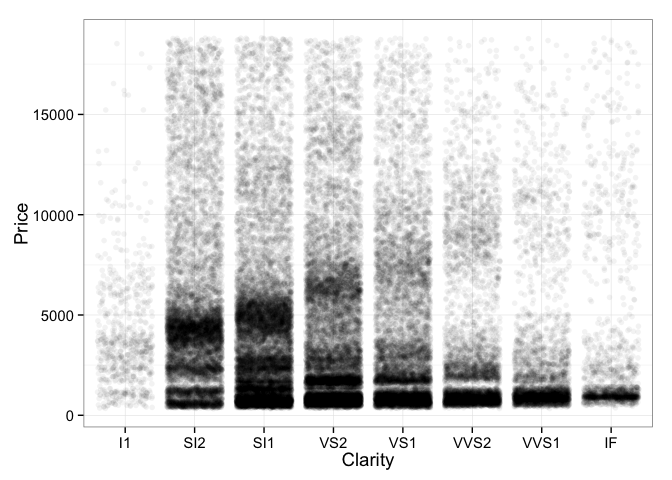

The boxplot:

``` {.r}
qplot(clarity, price, data = diamonds, geom = "boxplot") +
  scale_x_discrete("Clarity") +
  scale_y_continuous("Price")
```

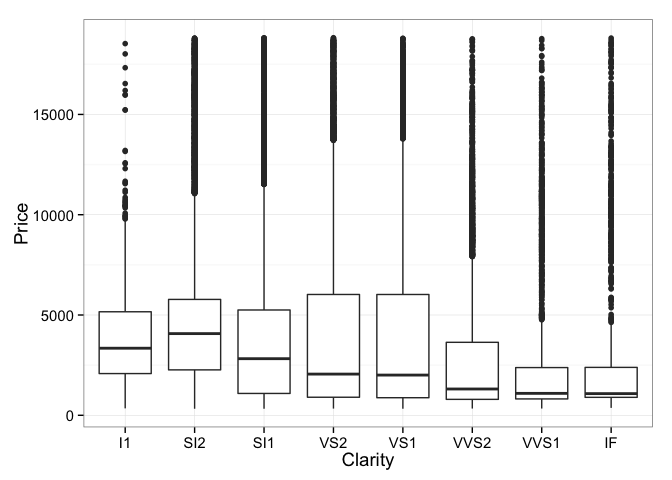

And the violin plot:

``` {.r}
qplot(clarity, price, data = diamonds, geom = "violin") +
  scale_x_discrete("Clarity") +
  scale_y_continuous("Price")
```

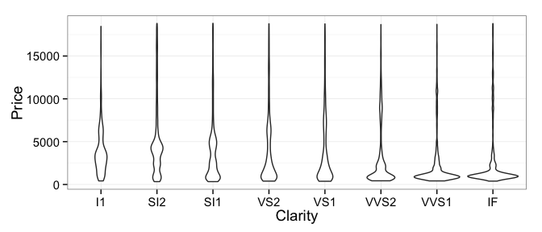

The more complex graphic:

``` {.r}
diamonds$size <- cut(diamonds$carat, c(0,.5,1,1.5,2,2.5,5))

qplot(clarity, price, 
    data = subset(diamonds, .5 < carat & carat <=2.5), 
    geom = "boxplot", fill = cut, outlier.size = .25
  ) + facet_grid(size ~ ., scales = "free") +
  scale_x_discrete("Clarity") +
  scale_y_continuous("Price") +
  scale_fill_discrete("Cut")
```

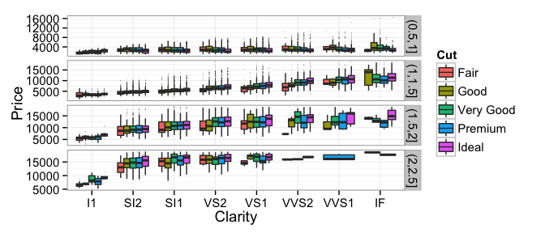

Discrete-discrete graphics
--------------------------

Scatter plot (with jittering, alpha-blending, and resizing):

``` {.r}
qplot(clarity, cut, data = diamonds, geom = "jitter", 
    alpha = I(.05), size = I(1.5)
  ) +
  scale_x_discrete("Clarity") +
  scale_y_discrete("Cut")
```

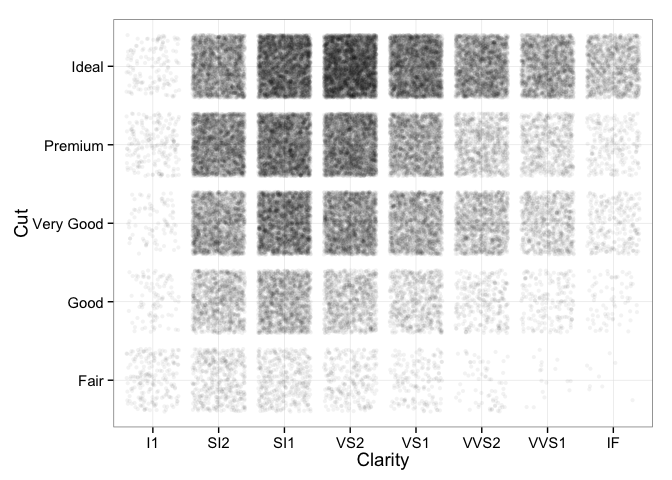

### Bar charts

The dodged bar chart:

``` {.r}
qplot(clarity, data = diamonds, geom = "bar", 
  fill = cut, position = "dodge")
```

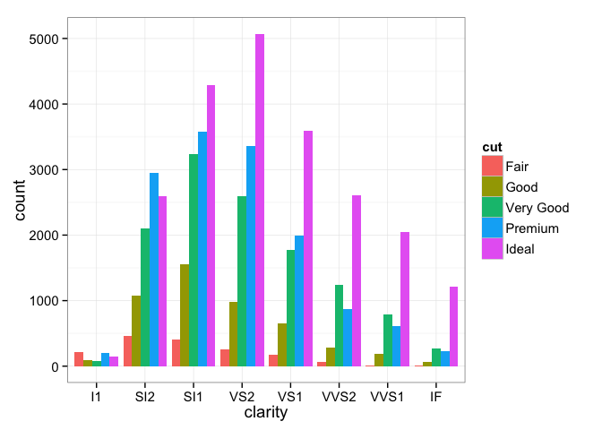

The stacked bar chart:

``` {.r}
qplot(clarity, data = diamonds, geom = "bar", 
  fill = cut, position = "stack")
```

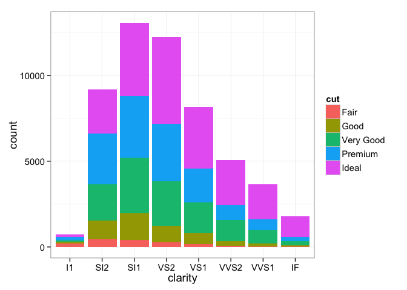

The pre-mosaic plot :

``` {.r}
props <- ddply(diamonds, "clarity", function(df){
  table(df$cut) / nrow(df)
})

mprops <- melt(props, id = "clarity")
ggplot(data = mprops) +
  geom_bar(
    aes(x = clarity, y = value, fill = variable), 
    stat = "identity"
  ) +
  scale_x_discrete("Clarity") +
  scale_y_continuous("Relative Frequency") +
  scale_fill_discrete("Cut")
```

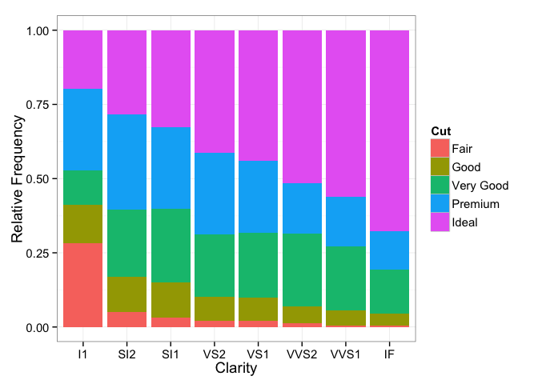

### The mosaic plot

``` {.r}
source("ggmosaic.r")
ggmosaic(clarity, cut, data = diamonds)
```

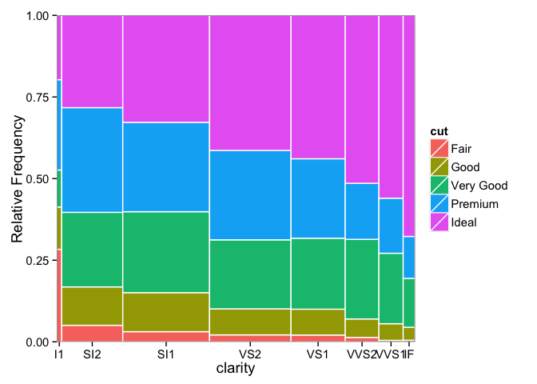
